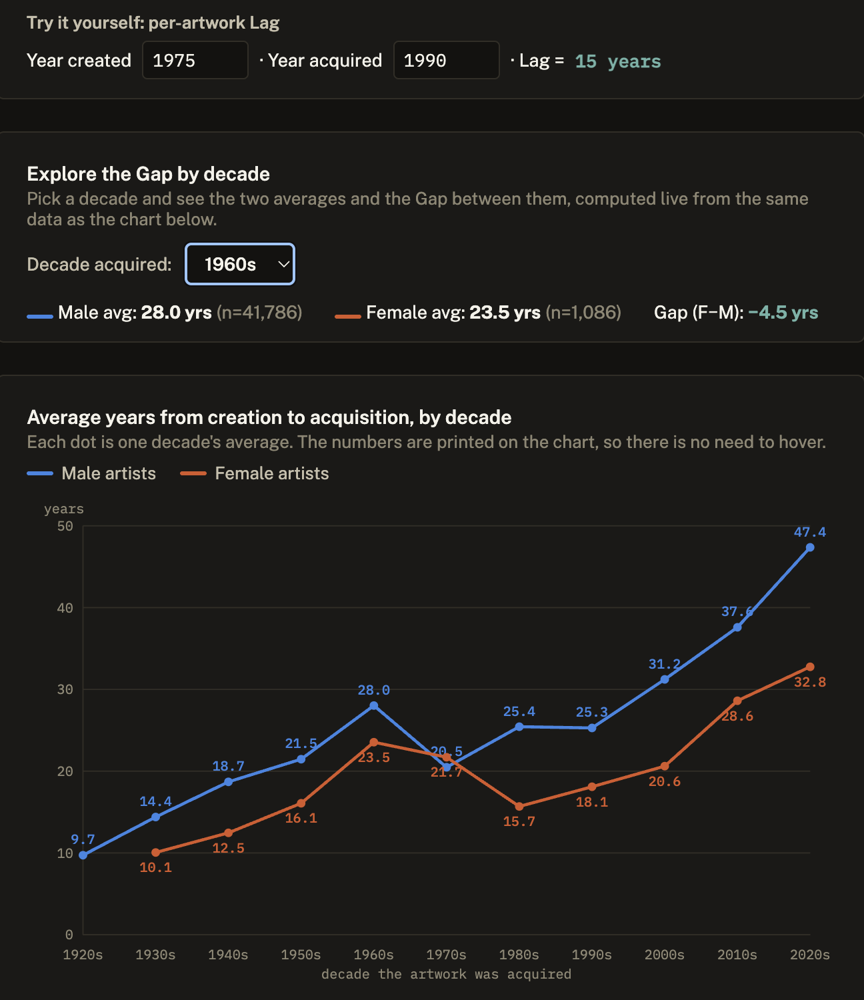

# MoMA Collection Analysis

**Does MoMA acquire women artists' work faster or slower than men's?**

Using MoMA's public collection dataset (160,705 artworks, 1929 to present), this project measures acquisition lag, the years between an artwork being made and MoMA acquiring it, and compares it by artist gender across a century of acquisitions.

**Finding:** Women's work is acquired sooner after it is made than men's work, not later. The average gap is about 5.7 years (22.9 years for women vs. 28.6 years for men), and this holds true in almost every decade from the 1930s to the 2020s. This is the opposite of what we would expect if MoMA were mainly correcting for overlooked women artists years after the fact.



*See the full interactive version, including a decade-by-decade explorer, [here](https://ikuznetsova0207.github.io/MoMA-Acquisition-Lag/chart.html).*

## Project structure

- `notebooks/01_initial_exploration.ipynb`, first look at the raw data: shape, missing values, value counts
- `notebooks/02_data_cleaning.ipynb`, the cleaning pipeline, one column at a time, with the reasoning for every decision written down
- `notebooks/03_gender_acquisition_lag.ipynb`, the analysis behind the finding above, plus the full conclusion
- `src/profiling.py`, `src/loading.py`, small reusable helpers used across the notebooks
- `data/raw/`, the original, untouched CSV (not committed, see below)
- `data/processed/`, the cleaned dataset produced by the cleaning notebook (not committed)

## Data

Source: [MoMA/collection](https://github.com/MuseumofModernArt/collection), `Artworks.csv` (30 columns: title, artist, nationality, gender, date, medium, dimensions, classification, department, acquisition info, image URLs).

Raw and processed data are not committed to this repo (see `.gitignore`). To reproduce, download `Artworks.csv` from the source above and place it in `data/raw/`.

## Setup

```bash
python3 -m venv venv
source venv/bin/activate
pip install -r requirements.txt
jupyter notebook
```

## Limitations

This dataset is not exhaustive. 18,200 artworks are excluded from the gender analysis, either because a creation year or acquisition date could not be determined, or because gender was missing or recorded as something other than exactly "male" or "female." Among the artworks included, men outnumber women roughly 6 to 1 overall, more heavily before 1960. Full details are in `03_gender_acquisition_lag.ipynb`.
